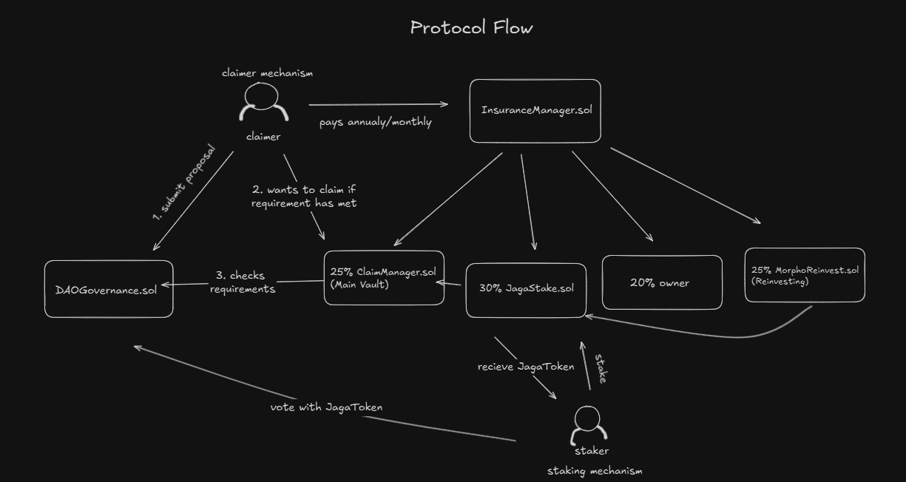

# Jagantara 🛡️

Jagantara is a decentralized insurance platform that gives people a fair and transparent way to protect themselves from unexpected losses. Instead of relying on a traditional insurance company, users pay a regular premium directly into a smart contract. When something happens and a user needs to make a claim, the community of token holders—through a decentralized autonomous organization (DAO) reviews and votes on whether the claim should be approved.

Jagantara doesn't just protect claimants; it also rewards users who help secure the system. Anyone can stake stablecoins like USDC in the protocol to support its financial health. In return, they receive a token called JagaToken, which gives them the right to vote on claims and earn a share of the protocol's revenue. This creates a balanced ecosystem where claimants, voters, and stakers all play important roles. The system is governed entirely by code, with no centralized authority, making it transparent, secure, and community-driven from end to end.

## Contracts

| Contract               | Description                                                                        |
| ---------------------- | ---------------------------------------------------------------------------------- |
| `InsuranceManager.sol` | Accepts premium payments, manages policy states, and distributes funds monthly.    |
| `DAOGovernance.sol`    | DAO that governs claims through token-weighted voting.                             |
| `ClaimManager.sol`     | Executes payouts for approved claims.                                              |
| `JagaStake.sol`        | Enables USDC staking and distributes synthetix-style continuous rewards.           |
| `MorphoReinvest.sol`   | Manage USDC deposits from revenue allocation into a Morpho Vault for reinvestment. |
| `JagaToken.sol`        | ERC20 token minted/burned during stake/unstake; used for governance voting.        |

Jagantara Contract on Lisk Sepolia:

- USDC 
https://sepolia-blockscout.lisk.com/token/0xA2D17a5CAEbEC48a32fF945aAF5471Eb9b989345?tab=contract

- JagaToken
https://sepolia-blockscout.lisk.com/token/0x529bB304E550E21938c20D1E27EAa4EE0dB549E6?tab=contract

- Insurance Manager
https://sepolia-blockscout.lisk.com/address/0x3A70a20d10381447B5c1DaB62fDcE23Df9079A8E?tab=contract

- Jaga Stake
https://sepolia-blockscout.lisk.com/address/0x65165BFb8162744E1C5251c1deB196bB270fE1eE?tab=contract

- Morpho
https://sepolia-blockscout.lisk.com/address/0xFDe181Ca94A77c3C0Bdf225963725a8E4680ADcF?tab=contract

- Claim Manager
https://sepolia-blockscout.lisk.com/address/0x72aE49071e641e38350EFbE4511C70C119E48875?tab=contract

- DAO Governance
https://sepolia-blockscout.lisk.com/address/0x43C67E463C7a9aF76c52194A095E69c35edEaAeA?tab=contract

- Morpho Re-invest
https://sepolia-blockscout.lisk.com/address/0xb09e395a600eA5848f9aE593538F2C584aE23773?tab=contract

## Flow Chart

## Revenue Flow

1. Premium Payment: Users pay USDC to InsuranceManager.

2. Revenue Split (Monthly):

- 25% → ClaimManager (Payout Vault)
- 30% → JagaStake (Staking Rewards)
- 20% → Owner
- 25% → MorphoReinvest (Reinvestment)

## Claiming Flow

1. User submits a claim via DAOGovernance.
2. Claim is voted on by users holding JagaToken.
3. If yes vote reached 66% after minimum of 5 days it produces approve response for the proposal.
4. If yes vote hasn't reached 66% after maximum of 7 days it produces reject response for the proposal.
5. If approved, user calls ClaimManager.claimPayout(claimId) to receive funds. Otherwise if rejected.

## Staking Flow

1. Stake USDC via JagaStake to receive JagaToken.
2. JagaToken grants DAO voting rights.
3. Rewards are distributed per 30 days.
4. Rewards come from 30% of protocol revenue (notifyRewardAmount).

## Key Roles

| Role          | Capabilities                                   |
| ------------- | ---------------------------------------------- |
| **Claimer**   | Pays premium and submits claims                |
| **Staker**    | Stakes USDC to earn yield & voting power       |
| **Owner**     | Can call `transferRevenue()` and update config |
| **DAO Voter** | Votes on claims using `JagaToken`              |
